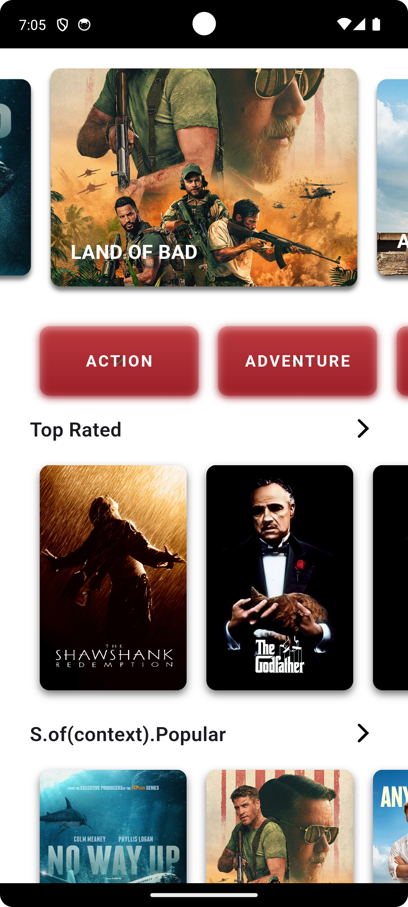
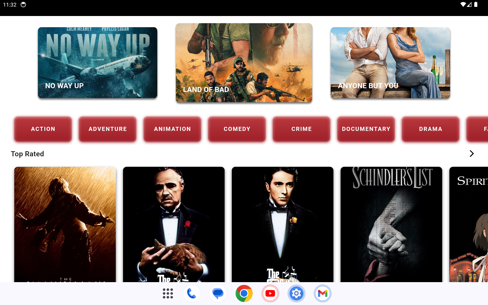

# Flutter Template

[](https://github.com/saifuzzafar/flutter_template_v1) [](https://github.com/saifuzzafar/flutter_template_v1)

## Screenshots
​    



## Table Of Content

- [Overview](#overview)
- [Getting Started](#getting-started)
    * [Requirements](#requirements)
    * [Setup](#setup)
- [Change Package Name](#change-package-name)
- [Create App](#create-app)
- [Architecture](#architecture)
    * [Mono Repo Architecture Extension](#mono-repo-architecture-extension)
    * [Layers](#layers)
- [Running/Debugger](#flavors)
    - [Flavors](#flavors)
- [Accelerate Development Process](#accelerate-development-process)
- [Features](#features)
- [Modules](#modules)
    * [List Default Modules](#list-default-modules)
-[Ongoing Enhancements](#ongoing-enhancements)

## Overview

[Flutter](https://flutter.io/) is Google's UI toolkit for building beautiful, natively compiled
applications for mobile, web, desktop, and embedded devices from a single codebase.

This is a micro-framework for Flutter which is designed to help simplify developing apps. Every
project provides a simple Template to help you build apps easier.

This project is open source, we welcome any contributions.

## Getting Started

#### Requirements

Here are some things you need to prepare before this Template setup:

1. Flutter SDK Stable (Latest Version) [Install](https://flutter.dev/docs/get-started/install)
2. Android Studio [Install](https://developer.android.com/studio)
3. Visual Studio Code (Optional) [Install](https://code.visualstudio.com/)
4. **Dart** and **Flutter** extensions:
    - **Intellij Platform** users ([Dart](https://plugins.jetbrains.com/plugin/6351-dart)
      , [Flutter](https://plugins.jetbrains.com/plugin/9212-flutter) )
    - **Visual Studio Code**
      users ([Dart](https://marketplace.visualstudio.com/items?itemName=Dart-Code.dart-code)
      , [Flutter](https://marketplace.visualstudio.com/items?itemName=Dart-Code.flutter) )

#### Setup

To set up your project based on this Template, you need to do some of the steps you need to do.

Here are the steps for setting up a Project with this Flutter-Works Template:

**Step 1:**

In this step you need to download(cloning) the files from this repository to your local computer:

``` bash
git clone https://github.com/saifuzzafar/flutter_template_v1.git
```

Or

``` bash
git clone git@github.com/saifuzzafar/flutter_template_v1.git
```

**Step 2:**

The next step is to open the folder that has been downloaded / cloned into a cli application such
as `bash`, `cmd`, `terminal` .

After cloning the repo and follow these steps to setup the project.

As we have mono repo clean architure each app's are sepated and each packages are separated. The template
uses [`melos`](https://melos.invertase.dev/) to manage all package and performing actions like
linting and running tests accross all packages. You can setup `melos`
from [here](https://melos.invertase.dev/getting-started).

Melos can be installed as a global package,

``` bash
dart pub global activate melos
```

#### Get Dependencies

```bash
melos run pub_get
```

#### Run Code Generation

```bash
melos run generate_files
```
## Change Package Name

By default package/project names:

`flutter_template_v1`

To change the package name, simply search for all `flutter_template_v1`, then replace it with
the new package name.

## Create App
As this is mono repo project you can create multiple apps inside apps folder.
for example: `flutter create your_app_name`

## Architecture

The architecture of the template facilitates separation of concerns and avoids tight coupling
between it's various layers. The goal is to have the ability to make changes to individual app's and packages
without affecting the other app. This architecture is an adaptation of concepts
from [`The Clean Architecture`](https://blog.cleancoder.com/uncle-bob/2012/08/13/the-clean-architecture.html).

### Mono Repo Architecture Extension
In addition to the Clean Architecture principles, this project extends its architecture to embrace the mono repo architecture paradigm. This extension enables the development of multiple apps within a single project, fostering modularity, scalability, and ease of management.

By leveraging the mono repo architecture, developers can efficiently manage dependencies, share code between projects, and ensure consistency across different applications developed within the same repository.

### Layers

The architecture is separated into the following layers

- [`apps`](apps/): It conatian all the apps.
    - [`movie_app`](apps/movie_app) : The movie app.
        - [`domain`](apps/movie_app/domain): Use cases for individual pieces of work.
        - [`data`](apps/movie_ap/data): Repositories to manage various data sources.
        - [`presentation`](apps/movie_ap/presentation): UI for mobile, tab and web it also containt he statemangment techniques(i.e cubit).
- [`pacakges`](packages/): It conatian the custom packages which will be used by all apps.
    - [`core`](packages/core): Core business implementation.
    - [`core_flutter`](packages/core_flutter): Core UI reusuable Components.

Each app has a `di` directory to manage Dependency Injection for that layer.

Read the [dependency management documentation](dependency-injection/README.md) to learn about all
the scripts used in the project.

## Flavors

The template comes with built-in support for 3 flavors. Each flavor uses a different `main.dart`
file.

- Dev - [`main_dev.dart`](apps/movie_app/lib/main/main_dev.dart)
- QA - [`main_qa.dart`](apps/movie_app/lib/main/main_qa.dart)
- Prod - [`main_prod.dart`](apps/movie_app/lib/main/main_prod.dart)

You can setup any environment specific values in the respective `main.dart` files.

To run a specific flavor you need to specify the flavor and target file.

```bash
 flutter run --flavor qa -t lib/entrypoints/main_qa.dart
```

**To avoid specifying all the flags every time, use the [`run.sh`](app/scripts/README.md#run)
script**

Read the [scripts documentation](app/scripts/README.md) to learn about all the scripts used in the
project.

## Accelerate Development Process
### 1. Module Generator:
As you know, the clean architecture of separation of concern means we need to create multiple layers with folders and files in them. So to speed up this process, we have a script called generate_modules. This script will generate all 3 layers (presentation, domain, and data) with the necessary folder and file. Dart files will also contain the starter class. Developers can save a lot of time by generating modules from the script, and they can focus on developing the business logic.
### 2. Code Generator:
Another good way to save time is to use the retrofit generator, which generates the API call methods for you. JSON serializable generates the entity classes for you to parse the API response. You can also generate the API request JSON parameters. 
### 3. Assets Generator:
In this template we are using [flutter_gen](https://pub.dev/packages/flutter_gen) to genrate the png, svg and fonts.
By doing this developers dont need to main the the separate file for image and fonts urls.

## Hide Generated Files (Optional)

In-order to hide generated files, navigate to `Android Studio` -> `Preferences` -> `Editor`
-> `File Types` and paste the below lines under `ignore files and folders` section:

```dart
*.config.dart;*.g.dart;
```

In Visual Studio Code, navigate to `Preferences` -> `Settings` and search for `Files:Exclude`. Add
the following patterns:

```dart

**/

*
* /*.g.dart
```

## Features

- Clean Architecture
- Adhering to SOLID Principles
- Repository Pattern for code separations
- Dependency Injection
- Network Layer
- Data Layer
- Automatic Error Handling
- Built-in support for 3 [`flavors`](https://docs.flutter.dev/deployment/flavors) - `dev`, `qa`
  and `prod`.
- Unit & Integration Tests
- [Localisation](./localisation/)
- Routing/Navigations
- [Responsive Framework](./wiki/responsive-framework/RESPONSIVE_FRAMEWORK.md)
- Pre-commit Checks
    - Dart Analysis
    - [`Flutter Lints`](https://pub.dev/packages/flutter_lints) for linting.
    - [Dart Fix](https://github.com/dart-lang/sdk/blob/main/pkg/dartdev/doc/dart-fix.md)
    - Flutter Format

## Libraries & Tools Used

- Dependency Injection - [GetIt](https://pub.dev/packages/get_it)
- Network - [Retrofit](https://pub.dev/packages/retrofit)
- Database - [Hive](https://pub.dev/packages/hive)
- Navigation - [Go Router](https://pub.dev/packages/go_router)
- Localisation - [Flutter Intl](https://www.jetbrains.com/help/idea/managing-plugins.html)
- [Responsive Farmework](https://pub.dev/packages/responsive_framework)

## Modules

## List of Default Modules

By default when you use this Template, there are several modules that are installed
automatically, here is a list of available modules:

| Name                                                   | Description                                                  |
| ------------------------------------------------------ | ------------------------------------------------------------ |
| [app](./app)                                           | A module containing apps |
| [core](./core)                                         | A module containing core business implementation of the product |
| [dependency-injection](./dependency-injection)         | A module that contains classes to achieve DI across multiple modules  based on `getIt` |
| [localisation](./localisation)                         | A module containing translation data          |

## Ongoing Enhancements
- Error/exception handling.
- Localisation improvement.
- Model class segregation.
- Code generator to save time.
- Assets management.
- Use riverpod instead of getIt for DI.
- Use riverpod instead of Cubit.
  
## Upcoming Improvements

Checklist of all
upcoming [enhancements](https://github.com/saifuzzafar/flutter_template_v1/issues)
.

## Contributing to this Project

Contributions are welcome from anyone and everyone. We encourage you to review
the [Guiding principles for contributing](CONTRIBUTING.md)
